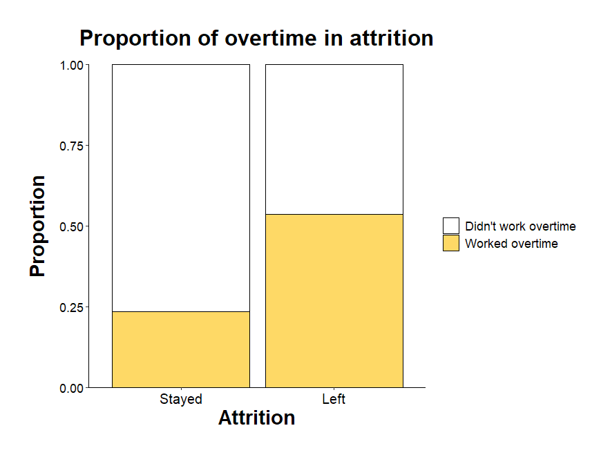
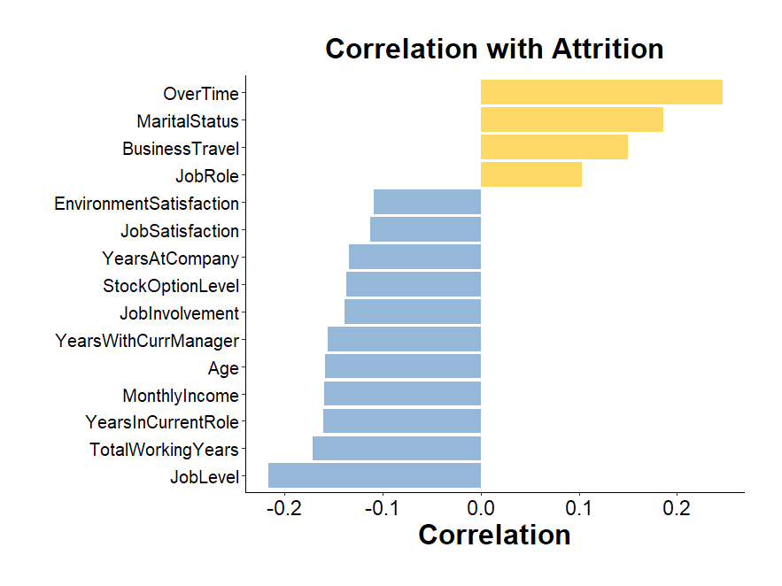
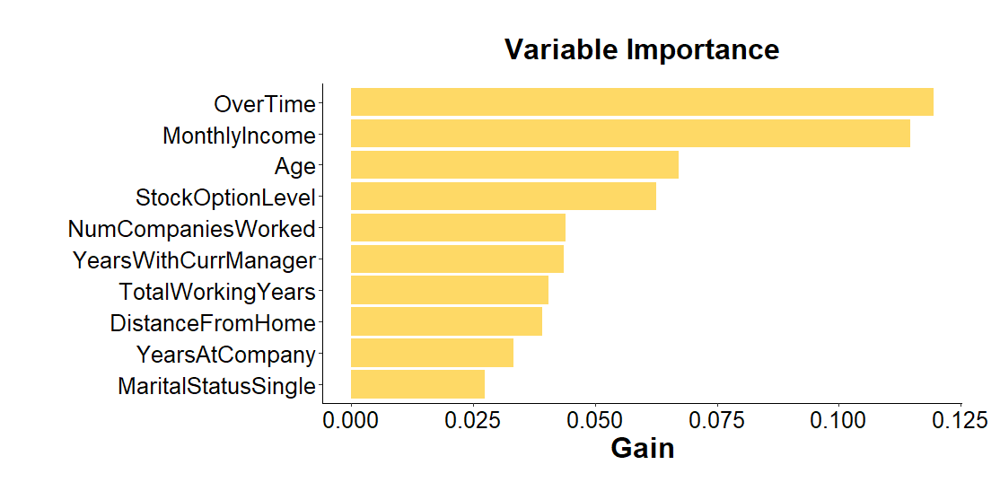
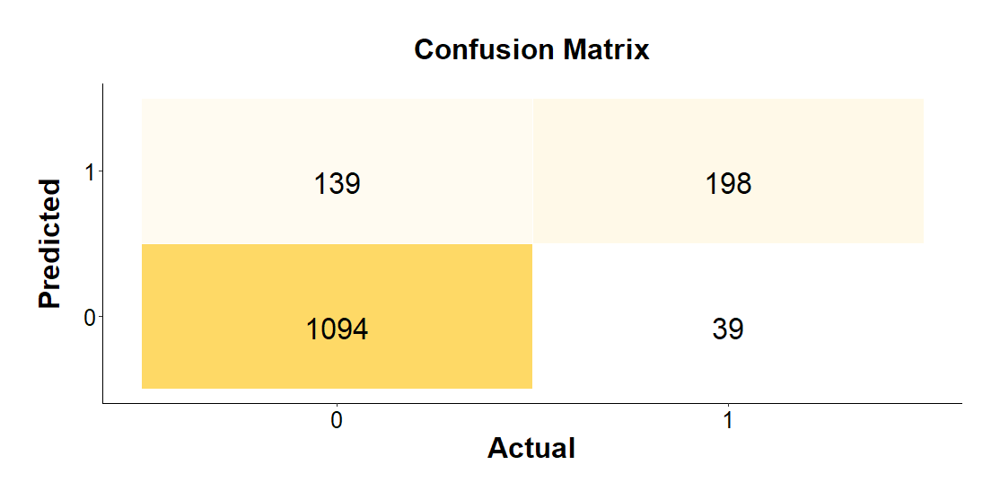
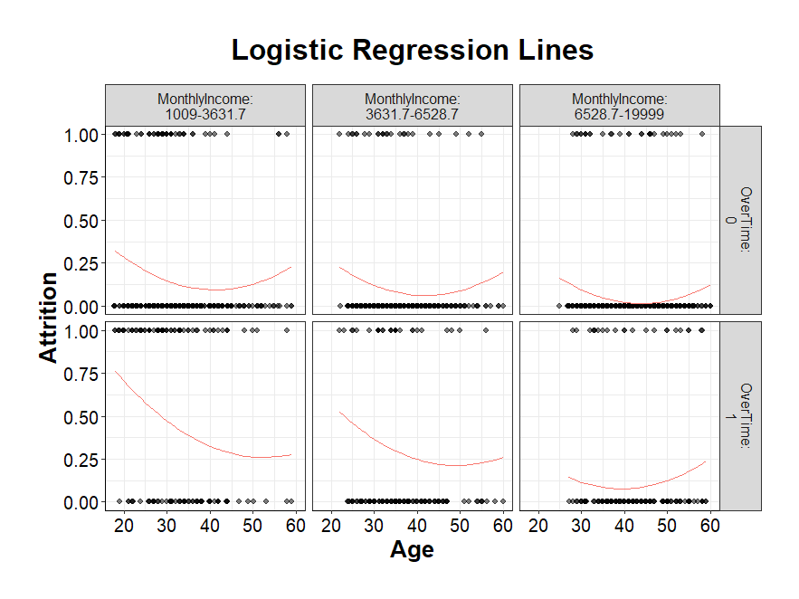
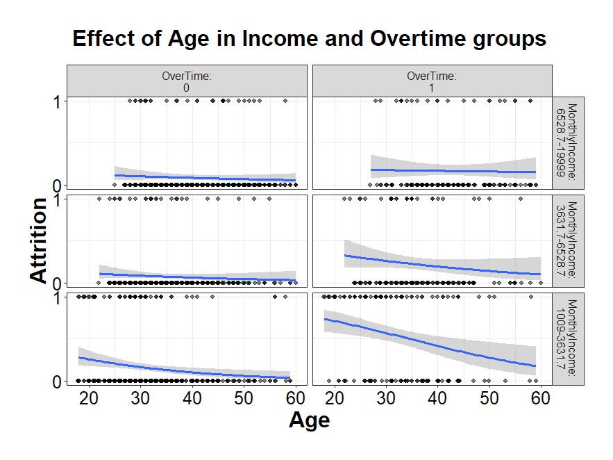

# Employee-Attrition-Analysis-and-Prediction
This repository was made to showcase my skills in data analysis and results presentation. Using HR Employee Attrition data from Kaggle, I conduct an complete analysis from preparing the data, through fitting different predictive models to drawing substantial and coherent conclusions. Both the analysis and visualizations were made in R Studio, and the article was assembled in LaTeX. 

I highly recommend checking the [final report](Employee_Attrition_Analysis_and_Prediction%20-%20Data%20Science%20Report.pdf), as it discusses the topic in more detail. 

You can also check the [R Code](Employee_attrition_code.R) file, where each step is described. This readme page is a summary and glimpse into my work.  

# Project Summary 

### About the Employee Attrition 
This project addresses the critical challenge of employee attrition - costly for organizations in terms of lost skills, morale, and productivity. Using the HR Analytics Dashboard: Employee Attrition 2025 dataset, the analysis combines data exploration and advanced predictive modeling to understand and anticipate which employees are most at risk of leaving, thus supporting HR strategies for retention and workforce planning.

### Data Preparation
The dataset comprised 1470 employees and 35 variables. Initial cleaning focused on removing uninformative columns (such as employee IDs and constant attributes) and selecting among overlapping financial indicators for clarity. Variables were properly typed for analysis - transforming dichotomies to numerics and ordering categorical scales. This ensured that the subsequent exploration and modeling were based on a streamlined, relevant dataset.

### Exploratory Data Analysis 
Exploratory analysis emphasized understanding the distribution and relationships of key features related to attrition. A major challenge identified was severe class imbalance: only a small fraction of employees had left. Initial statistics highlighted a workforce of mostly permanent, long-serving staff. By constructing a comprehensive correlation matrix (considering mixed variable types), the analysis identified overtime work, frequent business travel, long commutes, single marital status, and sales roles as features most strongly associated with attrition. Reviewing the profiles of employees who left revealed most departures occurred among younger, more overworked, and less satisfied staff—mirroring established literature on workplace turnover.




### Predictive Modelling 
To tackle prediction, three methods were employed:
- Conditional Random Forest (CForest): Leveraging its strengths in handling complex, nonlinear, and mixed data, CForest was tuned by iterative variable selection. Threshold optimization (Youden’s J statistic) enhanced sensitivity, allowing detection of potential attrition at the expense of some false positives. The final model identified twelve key predictors and achieved high sensitivity (96%) but lower precision due to the dataset’s imbalance.
- Extreme Gradient Boosting (XGBoost): XGBoost’s flexibility and ability to handle imbalanced data were further utilized. Hyperparameter tuning was performed with grid search and cross-validation. This model improved overall accuracy and precision compared to CForest, suggesting a better balance in identifying actual cases of attrition.




 
- Logistic Regression: The final stage involved classical statistical modeling to ensure interpretability and the possibility of direct application to future data. Using only the most significant predictors and their interactions (notably overtime, income, and age), even the best logistic model could explain only a modest proportion of the variability (about 17%), and was ultimately outperformed by the machine learning approaches.



### Learning and Insights 
Machine learning methods, particularly tree-based ensembles, outperformed traditional regression due to their ability to capture complex, non-linear relations and interactions. Variable importance analyses and exploratory plots consistently highlighted that attrition risk is concentrated among young, dissatisfied, and overworked employees, especially those working overtime and with lower incomes.



While random forests and boosted trees offer strong predictive performance and insights into variable importance, their results are less directly transportable without the underlying data. Conversely, logistic regression offers interpretability but lacks predictive power in this scenario due to the subtlety and multi-causality of attrition factors.

### Conclusions
The project demonstrates the power of data-driven approaches in diagnosing and predicting employee attrition, delivering actionable insights to HR teams and advancing data science skills ranging from EDA to advanced classification modeling and interpretability. Future actions could inlude further hyperparameter tuning, repeated cross-validation, exploring alternative models, feature engineering, and generating recommendations for data gathering to acquire more of the usefull information

Again, **full version of the report** available [here](Employee_Attrition_Analysis_and_Prediction%20-%20Data%20Science%20Report.pdf)

## Glimpse into selected fragments of the code

Most of the plots were made using ggplot2, the goal was to reproduce classic APA style:

```
ggplot(df, aes(factor(Attrition), fill = factor(OverTime))) +
    geom_bar(position = "fill", color = "black") +
    ylab("Proportion") +
    scale_y_continuous(labels = scales::percent)+
    scale_fill_manual(name = " ",
                      values = c("0" = "white", "1" = "#FED966"),
                      labels = c("Didn't work overtime", "Worked overtime"))+
    labs(x = "Attrition",
         y = "Proportion", 
         title = "Proportion of overtime in attrition")+
   scale_x_discrete(labels = c("0" = "Stayed", "1" = "Left")) +
   scale_y_continuous(expand = expansion(0)) +
   theme_classic() +
   theme(
     plot.margin = unit(c(1,1,1,1), "cm"),
     plot.title = element_text(size=22, face ="bold", hjust = 0.5, margin = margin(b=15)),
     axis.line = element_line(color = "black"),
     axis.title = element_text(size = 20, color = "black", face = "bold"),
     axis.title.y = element_text(margin = margin(r = 12)),
     axis.text = element_text(size = 14, color = "black"),
     axis.text.y = element_text(size = 12, color = "black"),
     legend.text = element_text(size = 12, color = "black"),
     legend.margin = margin(t=5, l=5, r=5, b=5)
   )
```
Also, flexplot was used to produce multivariate plots 
```
# Saving the plot as object
p = partial_residual_plot(Attrition~Age | MonthlyIncome + OverTime,
                        model = full3,
                        data = df,
                        method = "quadratic")

# Enhancing looks of the plot with ggplot2
 p + labs(title = "Logistic Regression Lines") +
         theme(
             legend.position = "none",
             plot.margin = unit(c(1,1,1,1), "cm"),
             plot.title = element_text(size=22, face ="bold", hjust = 0.5, margin = margin(b=15)),
             axis.text.x = element_text(size = 14, color = "black"),
             axis.text.y = element_text(size = 14, color = "black"),
             axis.title.x = element_text(size = 18, color = "black", face = "bold"),
             axis.title.y = element_text(size = 18, color = "black", face = "bold"),
             axis.line = element_line(color = "black")
           )
```
To find best parameters for XGBoost model, the *caret* package was used
```
# Grid of possible parameters values for XGBoost
  grid = expand.grid(
    nrounds = c(50, 100, 200),            
    max_depth = c(3, 6, 9),
    eta = c(0.01, 0.1, 0.3),
    gamma = c(0, 0.5, 1),
    colsample_bytree = c(0.5, 0.7, 1),
    min_child_weight = c(1, 3, 5),
    subsample = 0.5                     # sampling 50% dataset for training 
  )

# Data preparation for using AUC PR as evalution metric during grid search process
  df_fit = df_onehot  
  
  df_fit$Attrition = factor(df_fit$Attrition, levels = c("0", "1"), labels = c("Neg", "Pos"))
  
  x = df_fit[, setdiff(names(df_fit), "Attrition")]
  y = df_fit$Attrition

# Grid search 
  fit = train(
    x = x,
    y = y,
    method = "xgbTree",
    metric = "AUC",
    trControl = trainControl(method = "cv", number = 5,
                             classProbs = TRUE, summaryFunction = prSummary,
                             savePredictions = "final", verboseIter = TRUE),
    tuneGrid = grid
  )
```


